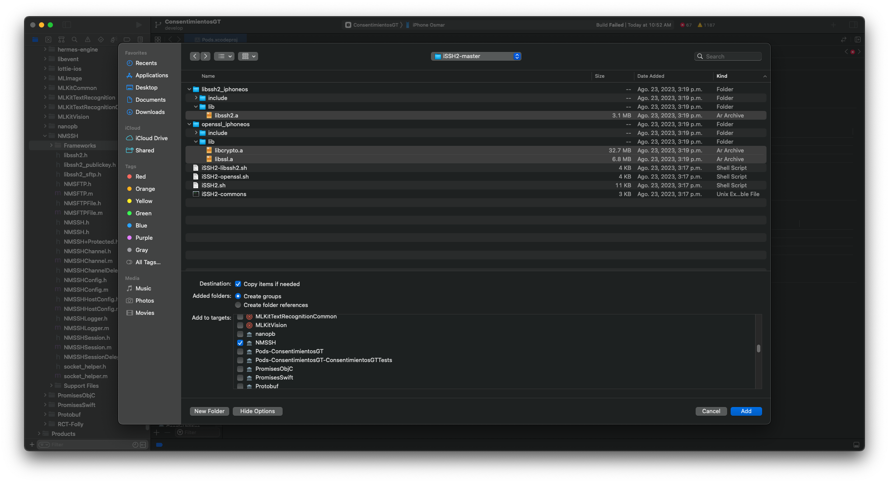

# react-native-ssh-sftp

SSH and SFTP client library for React Native.

## Installation

```
npm install react-native-ssh-sftp --save

yarn add react-native-ssh-sftp --save
```

##### Configuration iOS

1. Descargar el repositorio iSSH2 [Frugghi/iSSH2: A bash script to compile Libssh2 (and OpenSSL) for iOS, macOS, watchOS and tvOS. (github.com)](https://github.com/Frugghi/iSSH2)
2. En la terminal ejecutar chmod +x ./iSSH2.sh && ./iSSH2.sh "--platform=iphoneos" "--min-version=8.0" "--openssl=1.1.1s" "--libssh2=1.9.0" "--archs=arm64 arm64e x86_64"
   Nota: Este comando funciona en procesadores Apple Silicon de la línea M, desconozco si funcionaria en computadoras Mac con procesarores Intel
3. Se generaran 3 archivos con extensión .a
   1. Dentro de libssh2_iphoneos/lib se encuentra libssh2.a
   2. Dentro de openssl_iphoneos/lib se encuentra libcrypto.a y libssl.a
4. Luego dentro de Xcode, en el apartado de Pods, vamos dentro de la carpeta Pods y ubicamos el pod NMSSH/Frameworks, eliminamos el grupo y creamos un nuevo grupo llamado de la misma forma "Frameworks"
5. Damos click derecho sobre ella y se elige la opción de añdir archivos a "Pods" y añadimos los archivos mencionados anteriormente



##### Usage

### Create a client using password authentication

```javascript
import SSHClient from "react-native-ssh-sftp";

let client = new SSHClient("10.0.0.10", 22, "user", "password");
await client.connect();
```

### Create a client using public key authentication

```javascript
import SSHClient from "react-native-ssh-sftp";

let client = new SSHClient("10.0.0.10", 22, "user", { privateKey: "-----BEGIN RSA......" });

await client.connect();
```

- Public key authentication also supports:

```
{privateKey: '-----BEGIN RSA......'}
{privateKey: '-----BEGIN RSA......', publicKey: 'ssh-rsa AAAAB3NzaC1yc2EA......'}
{privateKey: '-----BEGIN RSA......', publicKey: 'ssh-rsa AAAAB3NzaC1yc2EA......', passphrase: 'Password'}
```

### Close client

```javascript
client.disconnect();
```

### Execute SSH command

```javascript
var command = "ls -l";
const output = await client.execute(command);
```

### Shell

#### Start shell:

- Supported ptyType: vanilla, vt100, vt102, vt220, ansi, xterm

```javascript
var ptyType = "vanilla";
await client.startShell(ptyType);
```

#### Read from shell:

```javascript
await client.on("Shell");
```

#### Write to shell:

```javascript
var str = "ls -l\n";
await client.writeToShell(str);
```

#### Close shell:

```javascript
client.closeShell();
```

### SFTP

#### Connect SFTP

```javascript
await client.connectSFTP();
```

#### List directory:

```javascript
var path = ".";
const response = await client.sftpLs(path);
```

#### Create directory:

```javascript
await client.sftpMkdir("/tmp/dirName");
```

#### Rename file or directory:

```javascript
await client.sftpRename("/tmp/test.tar.gz", "/tmp/test1.tar.gz");
```

#### Remove directory:

```javascript
await client.sftpRmdir("/tmp");
```

#### Remove file:

```javascript
await client.sftpRm("/tmp/test.tar.gz");
```

#### Download file:

```javascript
// Download progress
client.on("DownloadProgress", (percentage) => {
  console.warn(percentage);
});

const downloadedFilePath = await client.sftpDownload(
  "[path-to-remote-file]",
  "[path-to-local-direcotry]"
);

// Cancel download:
client.sftpCancelDownload();
```

#### Upload file:

```javascript
// Upload progress
client.on("UploadProgress", (percentage) => {
  console.warn(percentage);
});

await client.sftpUpload("[path-to-local-file]", "[path-to-remote-directory]");

// Cancel upload:
client.sftpCancelUpload();
```

#### Close SFTP (Android only):

```javascript
client.disconnectSFTP();
```

## Credits

- iOS SSH library: [NMSSH](https://github.com/NMSSH/NMSSH)
- Android SSH library: [JSch](http://www.jcraft.com/jsch/)
